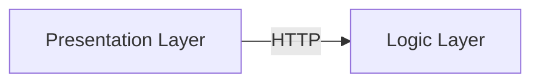
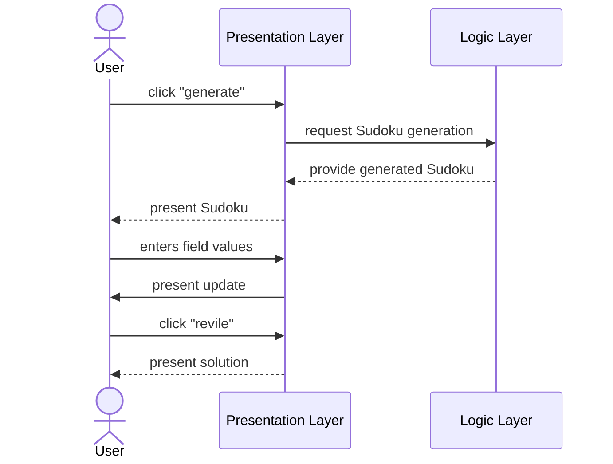
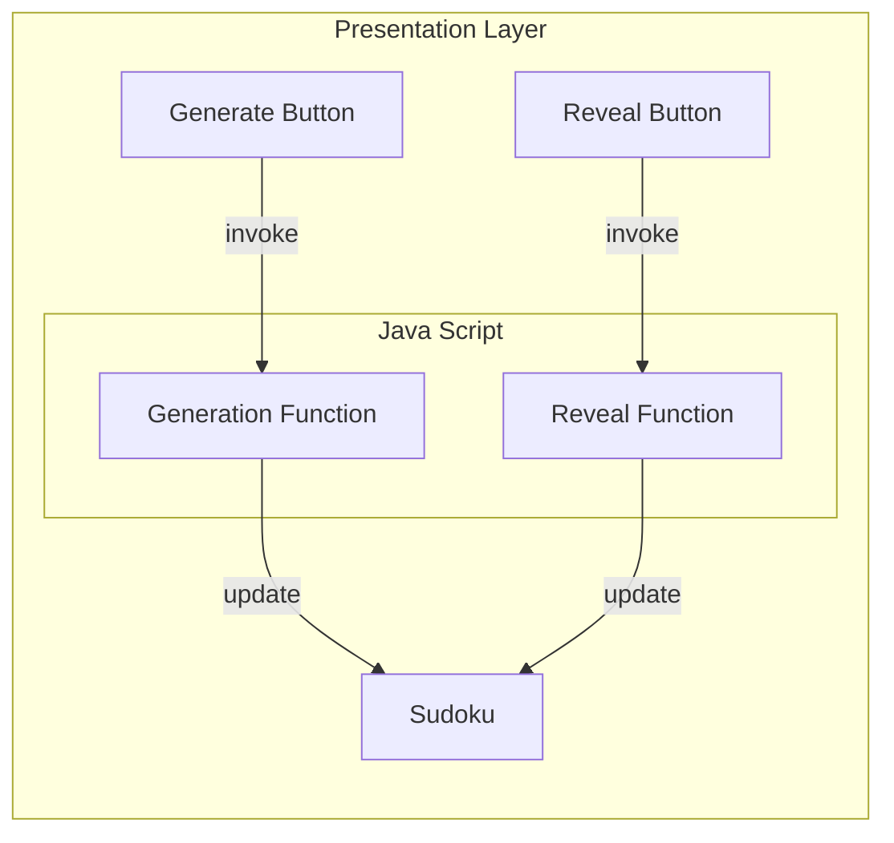
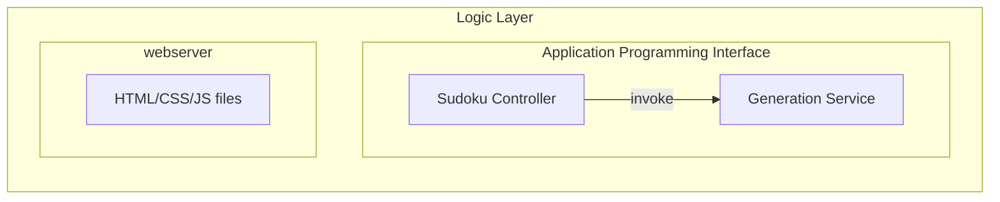
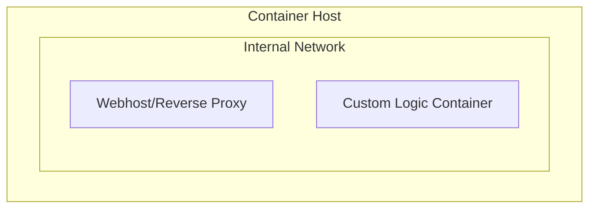
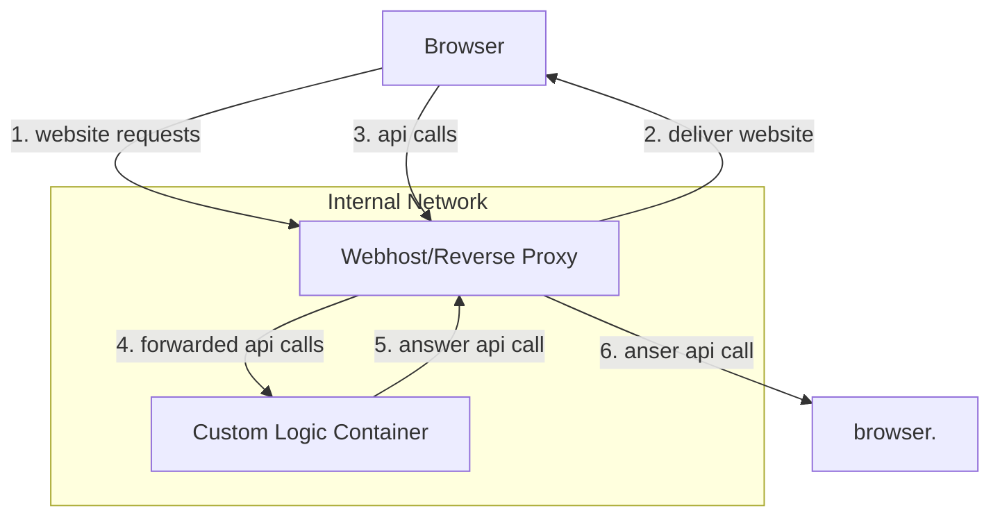

# DHBW Java Project

This repository holds the source code for a training exercise regarding the Java programming language.


## How to Run

With docker installed run this command inside the repository base directory...

```bash
docker compose up -d
```

... then open http://localhost:8080/ in your web browser.

## Requirements

The lecture demands the following to be fulfilled:

* Utilizing the [Java Programming Language](https://en.wikipedia.org/wiki/Java_(programming_language))
* Implements either [concurrency](https://en.wikipedia.org/wiki/Concurrency_(computer_science))or [web technologies](https://en.wikipedia.org/wiki/Web_development)
* Showcases the use of [generic types](https://docs.oracle.com/javase/tutorial/java/generics/types.html)
* Implements at least one [algorithm](https://en.wikipedia.org/wiki/Algorithm)
* Implements at least one [Java interface](https://docs.oracle.com/javase/tutorial/java/concepts/interface.html)
* The implementation must be executable

## Use Case: Sudoku

As use case, the game of [Sudoku](https://en.wikipedia.org/wiki/Sudoku) has been selected.
This should be a challenging enough, but still not to complex.

## Architecture

In regard software architecture, a layered architecture featuring a classic server-client pattern has been chosen.
This is due to the simplicity, an potential expandability of this approach. As a stretch goal one could for example later on expand the system with a ranking list where data is stored in a persistency layer.

* Presentation Layer: Web Bases Graphical User Interface allowing the user to play Sudoku.
* Logic Layer: Java Bases Application Programming Interface exposing algorithms for the web interface to be functional.

The communication protocol between these two layers is defined to be HTTP.

Having the Presentation Layer separated from the logic layer also has the advantage that they are loosely coupled and can have separate technologies.

### Technology Stack

For the Logic Layer, [OpenJDK](https://openjdk.org) should be used.
For the Presentation, [plain HTML/CSS/JS](https://www.ciat.edu/blog/html-css-javascript/#:~:text=HTML%20defines%20the%20structure%20of,learn%20them%20in%20that%20order.) is sufficient.
For the a container is the most elegant solution, here we choose something [OCI](https://opencontainers.org) compatible.

Versions:

* openjdk 17.0.11
* Apache Maven 3.6.3
* JUnit 3.8.2

### Structure Diagram



### Behavior Diagram



## Presentation Layer

As the purpose of the presentation layer to provide a graphical user interface and communicate with the Logic Layer, there is not meant to be any logic outside of that scope.

The fundamental structure can be describes as the following:



The HTML/CSS code should display a simple 9x9 Sudoku grid with 2 buttons to generate a new Sudoku and one to reveal the to the current Sudoku. The java script function invoked by generate button should hereby delegate Sudoku generation to the AP.

## Logic Layer

The purpose of the logic layer is the provide all necessary algorithm for the presentation layer via a API featuring HTTP endpoints. Additionally it should deliver the HTML/CSS/JS files for the browser.

Internally the Model-View-Controller pattern should be implemented.

The files can just be served from a normal webserver.



## Backtracking Algorithm

A backtracking algorithm is a problem-solving technique that incrementally builds candidates for the solution and abandons a candidate ("backtracks") as soon as it determines that the candidate cannot possibly lead to a valid solution.

### How It Works

1. Choose: Select the first option from the list of possible choices.
2. Explore: Recursively explore this choice. If it leads to a solution, return it.
3. Backtrack: If the current choice does not lead to a solution, remove it from the list and go back to the previous step to choose the next option.
4. Repeat: Continue this process until all options have been tried or a solution is found.

### Example

Consider solving a maze where the goal is to find a path from the start to the end:

1. Start at the initial position.
2. Try moving in one direction (e.g., north).
3. If that move leads to the end, the solution is found.
4. If it leads to a dead end, backtrack and try a different direction (e.g., east).
5. Repeat this process until the end is reached or all possible paths are explored.

### Advantages

- Simple to implement.
- Can find all possible solutions.

### Disadvantages

- Can be slow for large problems, as it may explore many possible paths.

### Generation Service/Algorithm

For the generation algorithm is the simplest to generate a fully populated valid Sudoku based on randomness, and remove values from it afterwards for the user to find. If we keep the "removed" values but hide them from the user, they can also be presented as a potential solution later on. This make the implementation of a actual solving algorithm unnecessary.

## Multiple Solutions in Sudoku

In some cases, the Sudoku puzzle you are solving may have more than one correct solution. This occurs when the initial configuration of the puzzle does not provide enough constraints to limit the solution to a single unique answer.

### Why Multiple Solutions Occur

1. Insufficient Clues: The initial puzzle setup may not have enough numbers filled in to uniquely determine a single solution.
2. Symmetry: Certain configurations can lead to symmetrical solutions, where multiple placements of numbers are equally valid.
3. Ambiguity: Some puzzles are inherently ambiguous and can be completed correctly in more than one way.

### Example

Consider a Sudoku puzzle where only a few cells are filled in. Depending on how these cells are arranged, there may be multiple ways to fill the remaining cells while still adhering to the rules of Sudoku (each number 1-9 appearing exactly once in each row, column, and 3x3 subgrid).

### Implications

- Puzzle Solving: When solving such puzzles, the algorithm may find one of the possible solutions but not necessarily the unique one.
- Validation: If you are validating a solution, it's important to consider that multiple correct answers can exist, and the presence of more than one solution does not imply an error.

### Handling Multiple Solutions

When implementing or solving Sudoku puzzles, it is useful to add additional constraints or provide more initial clues to ensure that the puzzle has a unique solution, if that is the desired outcome.

## Deployment View

There a two containers needed.

1. The custom logic container, which holds the generation algorithm
2. The presentation layer container, that hosts the website and routes requests to the logic container

Note: For the container of the presentation layer we can just use a standard NGINX, which also acts as a reverse proxy for the internal container network.



## Dataflow/Network Diagram


In regards to the dataflow:

1. the user requests the website via his browser from the Webhost/Reverse-Proxy
2. with the website loaded, the user can make API calls toward the webhost/reverse-proxy
3. the webhost/reverse-proxy forwards the api calls to the logic container
4. the logic container answers the api calls
5. the webhost/reverse-proxy relays the response back to the browser, where its processed



